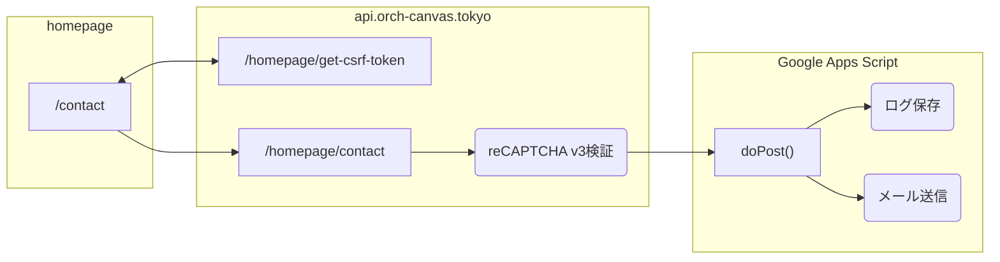

# homepage

## 技術概要

| 種類              | 技術仕様                                        | 備考                          |
| ----------------- | ----------------------------------------------- | ----------------------------- |
| フレームワーク    | SvelteKit                                       | Svelte, TypeScript, HTML, CSS |
| Linter, Formatter | svelte-check, Prettier, ESLint                  |                               |
| テンプレート管理  | hygen                                           |                               |
| コード管理        | GitHub                                          |                               |
| CI                | husky, GitHub Actions                           | コミット時、プッシュ時に実行  |
| デプロイ          | Cloudflare Pages                                |                               |
| CD                | Cloudflare PagesのGitHub連携                    | デプロイ条件は後述            |
| アクセス分析      | Cloudflare Web Analytics, Google Search Console |                               |

| 環境       | URL                              | デプロイ条件                                      |
| ---------- | -------------------------------- | ------------------------------------------------- |
| 本番       | [https://www.orch-canvas.tokyo/] | `main`ブランチへのプッシュ                        |
| プレビュー | ブランチごとに発行               | `develop`、`develop/*`ブランチへのプッシュ        |
| 開発       | コンソールに表示                 | `npm run dev`, `npm run build && npm run preview` |

その他、各コミットやブランチに対するプレビューURLが発行されます。
詳細は[Cloudflare ダッシュボード](https://dash.cloudflare.com/940baf35dc60e6a39b351d032b853543/pages/view/homepage)を参照。

## 開発環境の構築

```shell
npm install
npm run dev
```

## 日々のメンテナンス

### Newsの追加

`/src/lib/news.ts`内の`newsItems`に項目を追加

- SSR時に日付でソートされるため、配列内の追加位置は問いません。
- 最新の1～2件（画面サイズによる）がルートで表示されます。

### 演奏会の追加

```shell
# インタラクティブに各種パラメータを設定
$ npm run add:concert

# コマンドライン引数で一括指定も可能
$ npm run add:concert -- --type regular|chamber --number 999
```

- SSR時に演奏会開催日でソートされるため、`concerts`への追加順は問いません。
- `concerts`でエクスポートされた演奏会が、`/concerts/[slug]`で表示されます。
- `concerts`でエクスポートされた演奏会のうち、開催日が昨日以前のものが`/concerts/archives`で表示されます。

### スライドショー項目の編集

ルートで表示されるスライドショーの項目は、デフォルトでは「定期演奏会」のみです。

`/src/routes/+page.svelte`内の各項目を編集することで、定期演奏会以外を表示させたり、NEW!アイコンを付与したりすることができます。

| 変数                           | 役割                                             |
| ------------------------------ | ------------------------------------------------ |
| `nonRegularDisplayingConcerts` | 定期演奏会以外でスライドショーに表示させる演奏会 |
| `newConcerts`                  | NEW!アイコンを付与する演奏会                     |

スライドショーの順序は、演奏会開催日降順となります。

### パッケージの更新

[npm-check-updates](https://www.npmjs.com/package/npm-check-updates)を使うのがよさそうです。

```shell
npx npm-check-updates
npx npm-check-updates -u
npm install
```

## Contactの仕様



- [reCAPTCHA v3 Admin Console](https://www.google.com/recaptcha/admin/site/642565602) / [スプレッドシート](https://docs.google.com/spreadsheets/d/1uqnU0wP8CjgFnMpx_ObdDgKR96Ek7dxfY3E_dPL62Lw/edit)
- セッションを用いていないため、CSRFはトークンとタイムスタンプをセットで取り扱う。
- メール送信先はGoogle Apps Scriptのコードで管理されている。

## FAQ

### prettierがエラーになる

多くの場合`--write`オプション付きで走らせてくれとメッセージが出ますが、これはnpm scriptにデフォルトで登録されています。

```shell
npm run format
```

これでPrettierを`--format`オプション付きで走らせることができます。

VSCodeの設定でFormat On Saveを有効にしておくのもアツいと思います。

### コンポーネントをどこに配置しているのか

複数個所で用いられるような、普遍的なコンポーネントは`$lib/components`に配置しています。

一方、その場でのみ用いられるコンポーネントは`routes/`配下の各`+pages.svelte`と同じパスに配置しています。

- 気軽にコンポーネントとして切り出せるとコードの見通しがよくなる
- コンポーネントが増えすぎると、components配下が煩雑になり、その見通しが悪くなっていく

という諸性質の間をとることを目的としています。

Svelteが4だかで`+`接頭辞をつけたファイル名をエンドポイントと設定したのは、このような戦略をとった際のフォルダ内での見通しをよくするためな気がしていたり……
（`+page.svelte`などが先頭に配置される）

### アセットをどこに配置しているのか

[コンポーネント](#コンポーネントをどこに配置しているのか)と同様の考え方で、ローカルなアセットは`routes/`配下の各`+pages.svelte`や各`+layout.svelte`と同じパスに配置しています。

アセットの場合、現時点で普遍的なものは生じておらず、`$lib/assets`は作られていません。

`static/`にあるアセットはファビコンやCSSからインポートするといった、SvelteKitのエコシステム外のもののみとしています。

### コメント

できるだけ丁寧に、ていねいすぎるぐらいに書いていきたい。

あまり厳密なものではないですが、次のようなルールを目安としています。

- [What is TSDoc? | TSDoc](https://tsdoc.org/)
- [Document Svelte Projects with HTML and JSDoc Comments](https://blog.robino.dev/posts/doc-comments-svelte)

#### 各変数や関数にコメントにドキュメントコメント風のコメントをつける

```TypeScript
/** 特に意味のない文字列 */
const hoge: string = 'fuga'

/**
 * 文字列の初めにhogeをつける
 *
 * @param fuga - hogeをつけたい文字列
 * @returns hogeをつけた文字列
 */
cosnt doHoge = (fuga: string) => `hoge ${fuga}`
```

#### 隙があれば(インライン)コメントを辞さない

```TypeScript
type hoge = {
  name: string // フルネーム
}
```

#### コンポーネントやそのプロパティに対しコメントをつける

`@component`タグが用いられます。

```Svelte:CoolString
<script type="ts">
  /** 描画する文字列 */
  let content: string
</script>

<!--
@component
文字列をかっこよく描画するコンポーネント
- 文字数は○文字程度までしか検証していない
-->

<span class="very-very-cool">{content}</span>
```

### 関数、コンポーネントは、汎用的なものであれば用例をつけるとなお良い

`@example`タグが用いられます。

````TypeScript
/**
 * 文字列の初めにhogeをつける
 *
 * @param fuga - hogeをつけたい文字列
 * @returns hogeをつけた文字列
 *
 * @example
 * ```TypeScript
 * const happyString = doHoge(lonelyString);
 * ```
 */
cosnt doHoge = (fuga: string) => `hoge ${fuga}`
````
